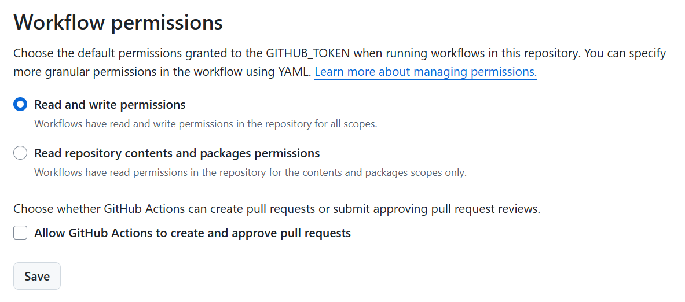

# weather-git-scraping

GitHub Actions used to scrape the weather️ 🌦️

## Setup

Make sure to grant read AND write workflow permissions to the Actions in the repo settings:

## Resources

- https://simonwillison.net/2020/Oct/9/git-scraping/
- https://flatgithub.com/